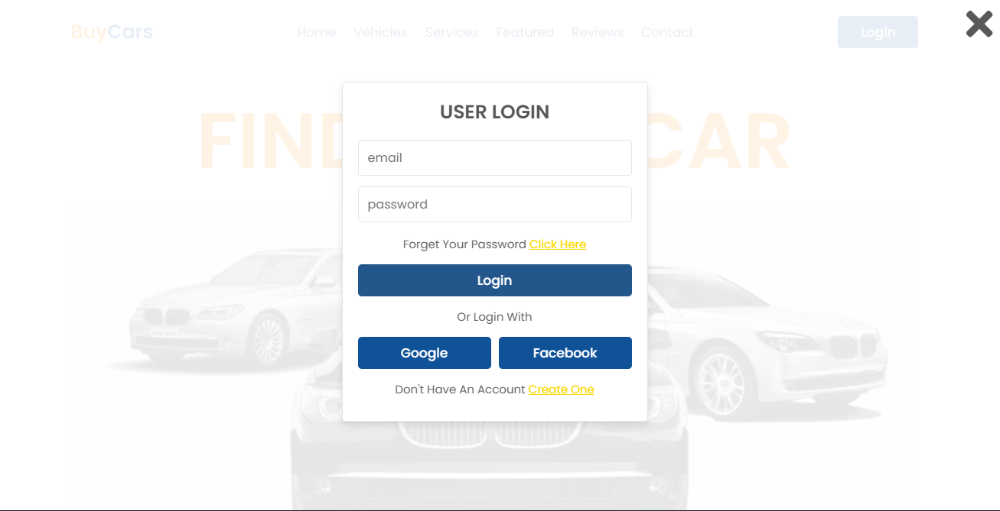

# 🚗 BuyCars — Car Buy & Sell Marketplace

BuyCars is a full-stack web application designed for buying, listing, and managing vehicle sales[cite: 1]. Built using PHP 8 and MySQL, the platform features dynamic searching, wishlist tracking, a direct buyer-to-seller inquiry system, dynamic state updates via AJAX, and a comprehensive admin control panel for moderation.

---

## 📸 Screenshots

| Home Page | User Login Page |
| :---: | :---: |
|  |  |

| Popular Vehicles | Featured Showcase |
| :---: | :---: |
|  |  |

| Contact Us |
| :---: |
|  |

---

## ✨ Features

### User Side
| Feature | Details |
|---|---|
| **Browse & Search** | Filter by brand, fuel, transmission, max price; sort by date / price / views |
| **Car Details** | Full multi-photo gallery with thumbnail preview, specs, seller info[cite: 1, 2] |
| **Wishlist** | Save favourite cars with instantaneous background AJAX toggles[cite: 1, 2] |
| **Sell a Car** | Multi-photo upload form, pending admin approval workflow[cite: 1, 2] |
| **Inquiry System** | Message sellers directly from the car detail page[cite: 1, 2] |
| **Dashboard** | Dedicated user stats overview — active listings, inquiries, wishlist count[cite: 1, 2] |
| **My Listings** | View, edit, and manage your own car posts |
| **Profile** | Update name / phone / change password |
| **Reviews & Feedback** | Homepage testimonials pulled dynamically from the database |
| **Newsletter** | Integrated email subscription form |
| **Contact Form** | General enquiry form routed directly to the admin inbox |

### Admin Panel (`/admin/`)
| Feature | Details |
|---|---|
| **Dashboard** | Live metrics tracking active listings, platform inquiries, user counts, and total inventory valuation[cite: 1, 2] |
| **Manage Cars** | Approve, reject, mark as sold, or delete submitted vehicle posts[cite: 1, 2] |
| **Manage Users** | Block, unblock, or delete user accounts |
| **View Inquiries** | Audit and manage all buyer-seller messages |
| **Contact Messages** | Review messages from the Contact Us form; auto-marks as read |
| **Testimonials** | Control and update homepage reviews[cite: 1, 2] |

---

## 🔒 Security Practices

- **Password Hashing:** Secure password hashing using `password_hash()` (bcrypt)[cite: 1, 2].
- **Prepared Statements:** Prepared statements via PDO to prevent SQL injection vulnerabilities[cite: 1, 2].
- **CSRF Protection:** CSRF token validation on all form requests[cite: 1, 2].
- **Upload Validation:** Strict file extension and MIME-type validation for image uploads (max 5 MB limit)[cite: 1, 2].
- **Middleware Guards:** Strict middleware checks (`require_admin()`) guarding administrative endpoints[cite: 1, 2].

---

## 📁 Project Structure
