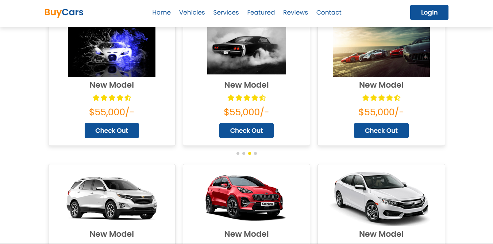

# BuyCars — Car Buy & Sell Marketplace

BuyCars is a full-stack web application designed for buying, listing, and managing vehicle sales. Built using PHP 8 and MySQL, the platform features dynamic searching, wishlist tracking, a direct buyer-to-seller inquiry system, and a comprehensive admin control panel for moderation.

I developed this platform to demonstrate backend session handling, database relationship mapping with PDO, dynamic state updates via AJAX, and role-based administrative workflows.

---

## Screenshots

| Home Page | User Login Page |
| :---: | :---: |
|  |  |

| Popular Vehicles | Featured Showcase |
| :---: | :---: |
|  |  |

| Contact Us |
| :---: |
|  |

---

## Features

### Buyer & Seller Platform
- **Advanced Search & Filtering:** Filter vehicles by brand, fuel type, transmission, and max budget with custom sorting options.
- **Interactive Listings:** Multi-photo upload gallery, detailed spec sheet, and seller contact details.
- **Wishlist Management:** Save favorite vehicles instantly via background AJAX toggles[cite: 2].
- **Direct Messaging:** Built-in inquiry form enabling direct communication with car sellers[cite: 2].
- **User Dashboard:** Dedicated profile management to track active listings, inquiries, and saved cars[cite: 2].

### Admin Panel (`/admin/`)
- **Listing Moderation:** Approve, reject, mark as sold, or delete submitted vehicle posts[cite: 2].
- **Analytics Dashboard:** Live metrics tracking active listings, platform inquiries, user counts, and total inventory valuation[cite: 2].
- **User & Content Control:** Moderation tools to manage accounts, review contact submissions, and update homepage testimonials[cite: 2].

---

## Security Practices

- Password hashing using `password_hash()` (bcrypt)[cite: 2].
- Prepared statements via PDO to prevent SQL injection vulnerabilities[cite: 2].
- CSRF token validation on all form requests[cite: 2].
- File extension and MIME-type validation for image uploads (max 5 MB limit)[cite: 2].
- Strict middleware checks (`require_admin()`) guarding administrative endpoints[cite: 2].

---

## Tech Stack

- **Frontend:** HTML5, CSS3, JavaScript (ES6+), Swiper.js, AOS.js, Boxicons[cite: 2]
- **Backend:** PHP 8+[cite: 2]
- **Database:** MySQL (PDO)[cite: 2]

---

## Database & Installation Setup

### 1. Database Setup
1. Launch **Apache** and **MySQL** in your local server environment (XAMPP/WAMP)[cite: 2].
2. Open **phpMyAdmin** (`http://localhost/phpmyadmin`) and create a new database named **`car_marketplace`**[cite: 2].
3. Select `car_marketplace`, open the **Import** tab, choose `database/car_marketplace.sql`, and click **Go**[cite: 2].

### 2. Connection Settings
Ensure your credentials in `config/db.php` match your environment[cite: 2]:

```php
define('DB_HOST', 'localhost');
define('DB_NAME', 'car_marketplace');
define('DB_USER', 'root');
define('DB_PASS', '');
